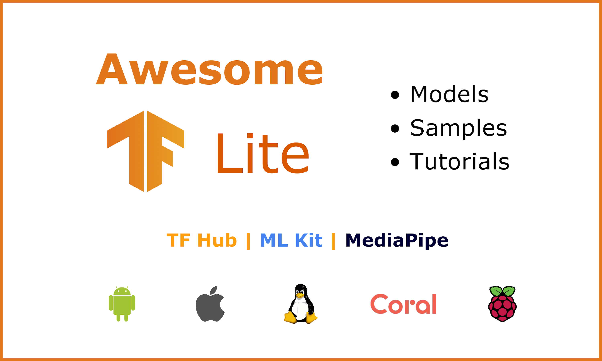

Please star the repo if you find it useful…

# Awesome TFLite   
TensorFlow Lite (TFLite) is a set of tools that help convert and optimize TensorFlow models to run on mobile and edge devices - currently running on more than 4 billion devices! With TensorFlow 2.x, you can train a model with tf.Keras, easily convert model to .tflite and deploy it; or you can download a pretrained TFLite model from the model zoo.

This is a curated list of TFLite models with sample apps, model zoo, helpful tools and learning resources. The purpose of this repo is to -
* showcase what the community has built with TFLite 
* put all the samples side-by-side for easy references
* knowledge sharing and learning for everyone

Please submit a PR if you would like to contribute and follow the guidelines [here](CONTRIBUTING.md).

## New features 
Here are some new features recently announced at TensorFlow World:
* New **[MLIR](https://medium.com/tensorflow/mlir-a-new-intermediate-representation-and-compiler-framework-beba999ed18d)-based TFLite converter** - enables conversion of new classes of models such as Mask R-CNN and Mobile BERT etc, supports functional control flow and better error handling during conversion. It is now enabled by default in the nightly builds -  see details in the [updated](https://groups.google.com/a/tensorflow.org/d/msg/tflite/Z_h7706dt8Q/sNrjPj4yGgAJ) & [initial](https://groups.google.com/a/tensorflow.org/forum/#!msg/tflite/C7Ag0sUrLYg/tHYfDHmNAAAJ) announcements.
* **TFLite Android Support Library** - [documentation](https://github.com/tensorflow/tensorflow/tree/master/tensorflow/lite/experimental/support/java) | Sample code ([Android](https://github.com/tensorflow/examples/blob/master/lite/examples/image_classification/android/EXPLORE_THE_CODE.md))
* Create your custom classification models easily with the **TFLite Model Maker** (~~model customization API~~) -  Colab tutorials for [Image & Text](https://github.com/tensorflow/examples/tree/master/tensorflow_examples/lite/model_maker)
* **On-device training** is finally here! Currently limited to transfer learning for image classification only but it's a great start - [Blog](https://blog.tensorflow.org/2019/12/example-on-device-model-personalization.html) | Sample code ([Android](https://github.com/tensorflow/examples/blob/master/lite/examples/model_personalization/README.md)). Here is an example from the community - on-device activity recognition for next-generation privacy-preserving personal informatics apps - [Blog](https://aqibsaeed.github.io/on-device-activity-recognition) | [Android](https://github.com/aqibsaeed/on-device-activity-recognition). Leverage transfer learning for efficiently training context sensing models directly on the Android device without the need for sending data to the server.
* Accelerating TensorFlow Lite on Qualcomm Hexagon DSPs - [Blog](https://blog.tensorflow.org/2019/12/accelerating-tensorflow-lite-on-qualcomm.html) | [Documentation](https://github.com/tensorflow/tensorflow/blob/master/tensorflow/lite/g3doc/performance/hexagon_delegate.md)

## TFLite models
Here are the TFLite models with app / device implementations, and references.  
Note: pretrained TFLite models from MediaPipe are included, which you can implement with or without MediaPipe. 

### Computer vision

| Task           | Model         | App \| Reference                        | Source |
| -------------- |---------------| -------------------------------------- | --------- |
| Classification | MobileNetV1 ([download](https://storage.googleapis.com/download.tensorflow.org/models/tflite/mobilenet_v1_1.0_224_quant_and_labels.zip))| [Android](https://github.com/tensorflow/examples/tree/master/lite/examples/image_classification/android) \| [iOS](https://github.com/tensorflow/examples/tree/master/lite/examples/image_classification/ios) \| [Raspberry Pi](https://github.com/tensorflow/examples/tree/master/lite/examples/image_classification/raspberry_pi) \| [Overview](https://www.tensorflow.org/lite/models/image_classification/overview)| tensorflow.org |
| Classification | MobileNetV2   | Recognize Flowers with TFLite on Android [Codelab](https://codelabs.developers.google.com/codelabs/recognize-flowers-with-tensorflow-on-android/#0) \| [Android](https://github.com/tensorflow/examples/tree/master/lite/codelabs/flower_classification/android) | TensorFlow team |
| Classification | MobileNetV2   | Skin Lesion Detection [Android](https://github.com/AakashKumarNain/skin_cancer_detection/tree/master/demo)|Community|
| Object detection | Quantized COCO SSD MobileNet v1 ([download](https://storage.googleapis.com/download.tensorflow.org/models/tflite/coco_ssd_mobilenet_v1_1.0_quant_2018_06_29.zip)) | [Android](https://github.com/tensorflow/examples/tree/master/lite/examples/object_detection/android) \| [iOS](https://github.com/tensorflow/examples/tree/master/lite/examples/object_detection/ios) \| [Overview](https://www.tensorflow.org/lite/models/object_detection/overview#starter_model) | tensorflow.org |
| Object detection | YOLO        | [Flutter](https://blog.francium.tech/real-time-object-detection-on-mobile-with-flutter-tensorflow-lite-and-yolo-android-part-a0042c9b62c6) \| [Paper](https://arxiv.org/abs/1506.02640)  | Community |
| Object detection | MobileNetV2 SSD ([download](https://github.com/google/mediapipe/tree/master/mediapipe/models/ssdlite_object_detection.tflite)) | [Reference](https://github.com/google/mediapipe/blob/master/mediapipe/models/object_detection_saved_model/README.md) | MediaPipe |
| License Plate detection | SSD MobileNet [(download)](https://github.com/ariG23498/Flutter-License/blob/master/assets/detect.tflite) | [Flutter](https://github.com/ariG23498/Flutter-License) | Community |
| Face detection | BlazeFace ([download](https://github.com/google/mediapipe/tree/master/mediapipe/models/face_detection_front.tflite)) | [Paper](https://sites.google.com/corp/view/perception-cv4arvr/blazeface) \| [Model card](https://sites.google.com/corp/view/perception-cv4arvr/blazeface#h.p_21ojPZDx3cqq) | MediaPipe |
|Hand detection & tracking | Download:   [Palm detection](https://github.com/google/mediapipe/tree/master/mediapipe/models/palm_detection.tflite),   [2D hand landmark](https://github.com/google/mediapipe/tree/master/mediapipe/models/hand_landmark.tflite),   [3D hand landmark](https://github.com/google/mediapipe/tree/master/mediapipe/models/hand_landmark_3d.tflite) | [Blog post](https://mediapipe.page.link/handgoogleaiblog) \| [Model card](https://mediapipe.page.link/handmc) | MediaPipe |
| Pose estimation | Posenet ([download](https://storage.googleapis.com/download.tensorflow.org/models/tflite/posenet_mobilenet_v1_100_257x257_multi_kpt_stripped.tflite)) | [Android](https://github.com/tensorflow/examples/tree/master/lite/examples/posenet/android) \| [iOS](https://github.com/tensorflow/examples/tree/master/lite/examples/posenet/ios) \| [Overview](https://www.tensorflow.org/lite/models/pose_estimation/overview)| tensorflow.org |
| Segmentation | DeepLab V3 ([download](https://storage.googleapis.com/download.tensorflow.org/models/tflite/gpu/deeplabv3_257_mv_gpu.tflite)) |  [Flutter](https://github.com/kshitizrimal/Flutter-TFLite-Image-Segmentation) \| [Paper](https://arxiv.org/abs/1706.05587) | Community |
Segmentation (Flutter Realtime) | DeepLab V3 ([download](https://storage.googleapis.com/download.tensorflow.org/models/tflite/gpu/deeplabv3_257_mv_gpu.tflite)) |  [Flutter](https://github.com/kshitizrimal/tflite-realtime-flutter) \| [Paper](https://arxiv.org/abs/1706.05587) | Community |
| Segmentation | DeepLab V3 ([download](https://storage.googleapis.com/download.tensorflow.org/models/tflite/gpu/deeplabv3_257_mv_gpu.tflite)) | [Android](https://github.com/tensorflow/examples/tree/master/lite/examples/image_segmentation/android) \| [iOS](https://github.com/tensorflow/examples/tree/master/lite/examples/image_segmentation/ios) \| [Overview](https://www.tensorflow.org/lite/models/style_transfer/overview)  | tensorflow.org |
| Hair Segmentation | [Download](https://github.com/google/mediapipe/tree/master/mediapipe/models/hair_segmentation.tflite) | [Paper](https://sites.google.com/corp/view/perception-cv4arvr/hair-segmentation) \| [Model card](https://sites.google.com/corp/view/perception-cv4arvr/hair-segmentation#h.p_NimuO7PgHxlY) | MediaPipe |
| Style transfer |  Download:   [Style prediction](https://storage.googleapis.com/download.tensorflow.org/models/tflite/arbitrary_style_transfer/style_predict_quantized_256.tflite),   [Style transform](https://storage.googleapis.com/download.tensorflow.org/models/tflite/arbitrary_style_transfer/style_transfer_quantized_dynamic.tflite) | [Overview](https://www.tensorflow.org/lite/models/style_transfer/overview) \| [Android](https://github.com/tensorflow/examples/tree/master/lite/examples/style_transfer/android) | tensorflow.org|

### Text
| Task           | Model         | App \| Reference                       | Source    |
| -------------- |---------------| -------------------------------------- | --------- |
| Question & Answer | DistilBERT | [Android](https://github.com/huggingface/tflite-android-transformers/blob/master/bert) | Hugging Face |
| Text Generation | GPT-2 / DistilGPT2 | [Android](https://github.com/huggingface/tflite-android-transformers/blob/master/gpt2) | Hugging Face |
Text Classification | [Download](https://storage.googleapis.com/download.tensorflow.org/models/tflite/text_classification/text_classification.tflite) | [Android](https://github.com/tensorflow/examples/tree/master/lite/examples/text_classification/android) | tensorflow.org
Text Classification | [Download](https://storage.googleapis.com/download.tensorflow.org/models/tflite/text_classification/text_classification.tflite) | [iOS](https://github.com/khurram18/TextClassafication) | Community
Text Classification | [Download](https://storage.googleapis.com/download.tensorflow.org/models/tflite/text_classification/text_classification.tflite) | [Flutter](https://github.com/am15h/tflite_flutter_plugin/tree/master/example) | Community
### Speech
| Task               | Model    | App \| Reference    | Source    |
| ------------------ |----------| ------------------- | --------- |
| Speech Recognition | DeepSpeech | [Reference](https://github.com/mozilla/DeepSpeech/tree/master/native_client/java) | Mozilla |

## TFLite model zoo 
TFLite models that could be implemented in apps and things:
*  [MobileNet](https://github.com/tensorflow/models/blob/master/research/slim/nets/mobilenet/README.md)- pretrained MobileNet v2 and v3 models.
* TFLite models
    * [TensorFlow Lite models](https://www.tensorflow.org/lite/models) with Android and iOS examples
    * [TensorFlow Lite hosted models](https://www.tensorflow.org/lite/guide/hosted_models) with quantized and floating point variants 
    * [TFLite models from TensorFlow Hub](https://tfhub.dev/s?q=tflite)

## TensorFlow model zoo 
TensorFlow models that could be converted to TFLite and then implemented in apps and things:
* [Official TensorFlow models](https://github.com/tensorflow/models/tree/master/official)
* [Tensorflow detection model zoo](https://github.com/tensorflow/models/blob/master/research/object_detection/g3doc/detection_model_zoo.md) -
pre-trained on COCO, KITTI,  AVA v2.1, iNaturalist Species datasets

## ML Kit examples 
[ML Kit](https://developers.google.com/ml-kit) is a mobile SDK that brings Google's ML expertise to mobile devs.
* 10/1/2019 ML Kit Translate demo with material design - recognize, identify Language and translate text from live camera with ML Kit for Firebase - [Codelab](https://codelabs.developers.google.com/codelabs/mlkit-android-translate/#0) | [Android](https://github.com/googlecodelabs/mlkit-android/tree/master/translate) (Kotlin).
* 3/13/2019 Computer Vision with ML Kit - Flutter In Focus - [tutorial](https://youtu.be/ymyYUCrJnxU).
* 2/9/219 Flutter + MLKit: Business Card Mail Extractor - [tutorial](https://medium.com/flutter-community/flutter-mlkit-8039ec66b6a) | [Flutter](https://github.com/DaemonLoki/Business-Card-Mail-Extractor).
* 2/8/2019 From TensorFlow to ML Kit: Power your Android application with machine learning - [slides](https://speakerdeck.com/jinqian/from-tensorflow-to-ml-kit-power-your-android-application-with-machine-learning) | [Android](https://github.com/xebia-france/magritte) (Kotlin).
* 8/7/2018 Building a Custom Machine Learning Model on Android with TensorFlow Lite - [tutorial](https://medium.com/over-engineering/building-a-custom-machine-learning-model-on-android-with-tensorflow-lite-26447e53abf2).
* 7/20/2018 - ML Kit and Face Detection in Flutter - [tutorial](https://flatteredwithflutter.com/ml-kit-and-face-detection-in-flutter/).
* 7/27/2018 ML Kit on Android 4: Landmark Detection - [tutorial](https://medium.com/google-developer-experts/exploring-firebase-mlkit-on-android-landmark-detection-part-four-5e86b8deac3a).
* 7/28/2018 ML Kit on Android 3: Barcode Scanning - [tutorial](https://medium.com/google-developer-experts/exploring-firebase-mlkit-on-android-barcode-scanning-part-three-cc6f5921a108).
* 5/31/2018 ML Kit on Android 2: Face Detection - [tutorial](https://medium.com/google-developer-experts/exploring-firebase-mlkit-on-android-face-detection-part-two-de7e307c52e0).
* 5/22/2018 ML Kit on Android 1: Intro - [tutorial](https://medium.com/google-developer-experts/exploring-firebase-mlkit-on-android-introducing-mlkit-part-one-98fcfedbeee0).

## Other plugins, SDKs & platforms
* [Edge Impulse](https://www.edgeimpulse.com/) - helps you to train TFLite models for embedded devices in the cloud. ([@EdgeImpulse](https://twitter.com/EdgeImpulse))
* [Fritz.ai](https://www.fritz.ai/) - an ML platform that makes iOS and Android developers’ life easier: with pre-trained ML models and end-to-end platform for building and deploying custom trained models. ([@fritzlabs](https://twitter.com/fritzlabs))
* [MediaPipe](https://github.com/google/mediapipe) - a cross platform (mobile, desktop and Edge TPUs) AI pipeline by Google AI. (PM [Ming Yong](https://twitter.com/realmgyong)) | [MediaPipe examples](https://mediapipe.readthedocs.io/en/latest/examples.html)
* [Coral Edge TPU](https://coral.ai/) - Google’s edge hardware. [Coral Edge TPU examples](https://coral.ai/examples/)
* [TFLite Flutter Plugin](https://github.com/am15h/tflite_flutter_plugin/) - provides a dart API similar to the TFLite Java API for accessing TensorFlow Lite interpreter and performing inference in flutter apps. [tflite_flutter on pub.dev](https://pub.dev/packages/tflite_flutter)

## Helpful links 
* [Netron](https://github.com/lutzroeder/netron) - for visualizing models
* [AI benchmark](http://ai-benchmark.com/tests.html)  - for benchmarking computer vision models on smartphones
* [Performance benchmarks](https://www.tensorflow.org/lite/performance/benchmarks) for Android and iOS
* How to design machine learning powered features - [material design guidelines for ML](https://material.io/collections/machine-learning/patterns-for-machine-learning-powered-features.html) | [ML Kit Showcase App](https://github.com/firebase/mlkit-material-android)
* [The People + AI Guide book](https://pair.withgoogle.com/) - learn how to design human-centered AI products

## Learning resources 
Interested but not sure how to get started? Here are some learning resources that will help you whether you are a beginner or a practitioner in the field for a while.

### Documentation 
* TensorFlow Lite documentation ([link](https://www.tensorflow.org/lite))
* TensorFlow Lite for Microcontrollers documentation ([link](https://www.tensorflow.org/lite/microcontrollers))

### Blog posts 
* 4/20/2020 - What’s new in TensorFlow Lite from DevSummit 2020, Khanh LeViet. ([link](https://blog.tensorflow.org/2020/04/whats-new-in-tensorflow-lite-from-devsummit-2020.html))
* 4/17/2020 - Optimizing style transfer to run on mobile with TFLite, Khanh LeViet and Luiz Gustavo Martins. ([link](https://blog.tensorflow.org/2020/04/optimizing-style-transfer-to-run-on-mobile-with-tflite.html))
* 4/14/2020 - How TensorFlow Lite helps you from prototype to product, Khanh LeViet. ([link](https://blog.tensorflow.org/2020/04/how-tensorflow-lite-helps-you-from-prototype-to-product.html))
* 11/8/2019 - Getting  Started with ML on MCUs with TensorFlow, BRANDON SATROM. ([link](https://blog.particle.io/2019/11/08/particle-machine-learning-101/))
* 8/5/2019 - TensorFlow Model Optimization Toolkit — float16 quantization halves model size, the TensorFlow team. ([link](https://blog.tensorflow.org/2019/08/tensorflow-model-optimization-toolkit_5.html))
* 7/13/2018 - Training and serving a realtime mobile object detector in 30 minutes with Cloud TPUs, Sara Robinson, Aakanksha Chowdhery, and Jonathan Huang. ([link](https://blog.tensorflow.org/2018/07/training-and-serving-realtime-mobile-object-detector-cloud-tpus.html))
* 6/11/2018 - Why the Future of Machine Learning is Tiny, Pete Warden. ([link](https://petewarden.com/2018/06/11/why-the-future-of-machine-learning-is-tiny/))
* 3/30/2018 - Using TensorFlow Lite on Android, Laurence Moroney. ([link](https://blog.tensorflow.org/2018/03/using-tensorflow-lite-on-android.html))

### Books 
* 03/2020 - Raspberry Pi for Computer Vision ([Complete Bundle](https://www.pyimagesearch.com/raspberry-pi-for-computer-vision) | [TOC](https://www.pyimagesearch.com/2019/04/05/table-of-contents-raspberry-pi-for-computer-vision/)) by the PyImageSearch Team: Adrian Rosebrock ([@PyImageSearch](https://twitter.com/PyImageSearch)), David Hoffman, Asbhishek Thanki, Sayak Paul ([@RisingSayak](https://twitter.com/RisingSayak)), and David Mcduffee.
* 12/2019 - [TinyML](http://shop.oreilly.com/product/0636920254508.do) by Pete Warden ([@petewarden](https://twitter.com/petewarden)) and Daniel Situnayake ([@dansitu](https://twitter.com/dansitu)). 
* 10/2019 - [Practical Deep Learning for Cloud, Mobile, and Edge](https://www.practicaldeeplearning.ai/) by Anirudh Koul ([@AnirudhKoul](https://twitter.com/AnirudhKoul)), Siddha Ganju ([@SiddhaGanju](https://twitter.com/SiddhaGanju)), and Meher Kasam ([@MeherKasam](https://twitter.com/MeherKasam)).

### YouTube videos 
* 4/1/2020 - [Easy on-device ML from prototype to production](https://youtu.be/ALxWJoh_BHw) (TF Dev Summit '20)
* 3/11/2020 - [TensorFlow Lite: ML for mobile and IoT devices](https://youtu.be/27Zx-4GOQA8) (TF Dev Summit '20)
* 10/31/2019 - [Keynote - TensorFlow Lite: ML for mobile and IoT devices](https://www.youtube.com/watch?v=zjDGAiLqGk8) 
* 10/31/2019 - [TensorFlow Lite: Solution for running ML on-device](https://www.youtube.com/watch?v=0SpZy7iouFU)
* 10/31/2019 - [TensorFlow model optimization: Quantization and pruning](https://www.youtube.com/watch?v=3JWRVx1OKQQ) 
* 10/29/2019 - [Inside TensorFlow: TensorFlow Lite](https://www.youtube.com/watch?v=gHN0jDbJz8E&t=540s)
* 4/18/2018 - [TensorFlow Lite for Android (Coding TensorFlow)](https://www.youtube.com/watch?v=JnhW5tQ_7Vo&t=22s)

### MOOC 
* Udacity [Introduction to TensorFlow Lite](https://www.udacity.com/course/intro-to-tensorflow-lite--ud190) - by Daniel Situnayake ([@dansitu](https://twitter.com/dansitu)), Paige Bailey ([@DynamicWebPaige](https://twitter.com/DynamicWebPaige)), and Juan Delgado
* Coursera [Device-based Models with TensorFlow Lite](https://www.coursera.org/learn/device-based-models-tensorflow) - by Laurence Moroney ([@lmoroney](https://twitter.com/lmoroney))

