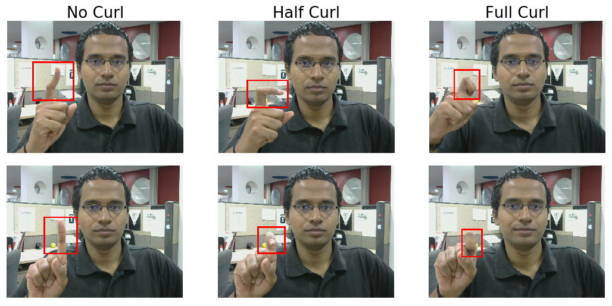
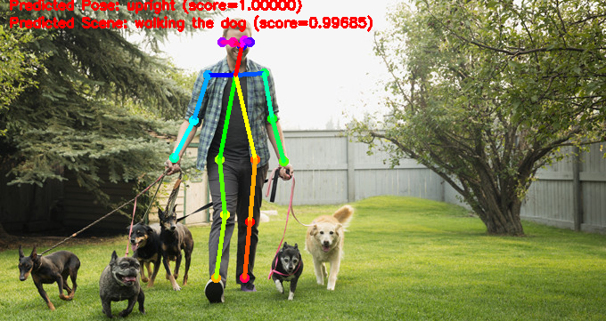

# Classify pose

Here are some ideas:
* [Human pose](https://github.com/dronefreak/human-action-classification)
Use TF Lite’s [PoseNet](https://www.tensorflow.org/lite/models/pose_estimation/overview) and add a layer of fully connected
* [Hand pose](https://github.com/Prasad9/Classify-HandGesturePose)
Use TF Lite’s [hand model](https://google.github.io/mediapipe/solutions/hands) from MediaPipe

Help needed:
* Generate ideas
* Write sample apps and tutorials

 

 

