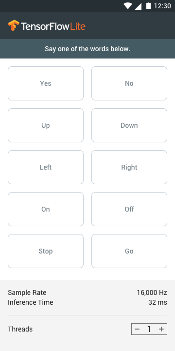

# Speech commands

There are already sample apps for Android and iOS for speech commands - recognition of speech Commands on mobile, highlighting the spoken word; however, there is no end-to-end tutorial on how to use it.

Help needed:
* Convert the TF1 training code to TF 2
* Write e2e tutorial on how to use and customize the sample

 

