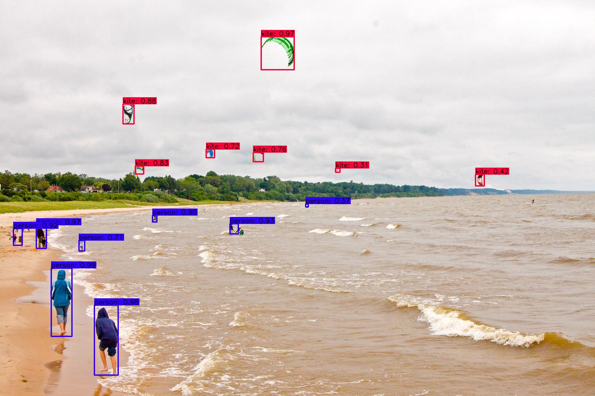

# YOLO

Object detection is one of the most popular on-device ML use cases.
Help needed:

* Convert an open-source YOLO TF implementation on GitHub to TF Lite.
* Publish a pre-trained model on TF Hub.
* Write a tutorial on how to train the model on custom dataset using transfer learning.

 

